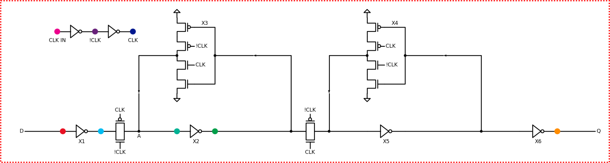
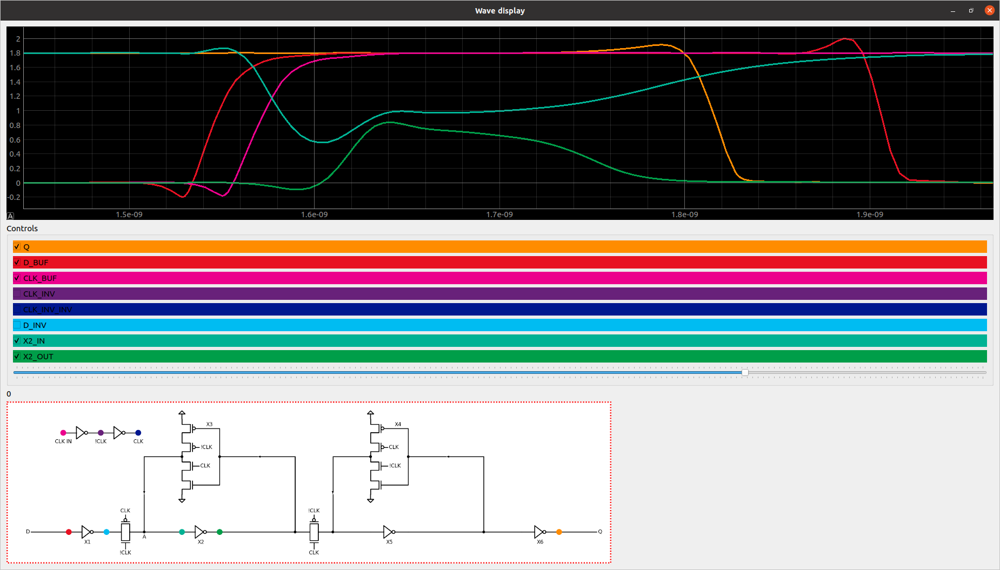
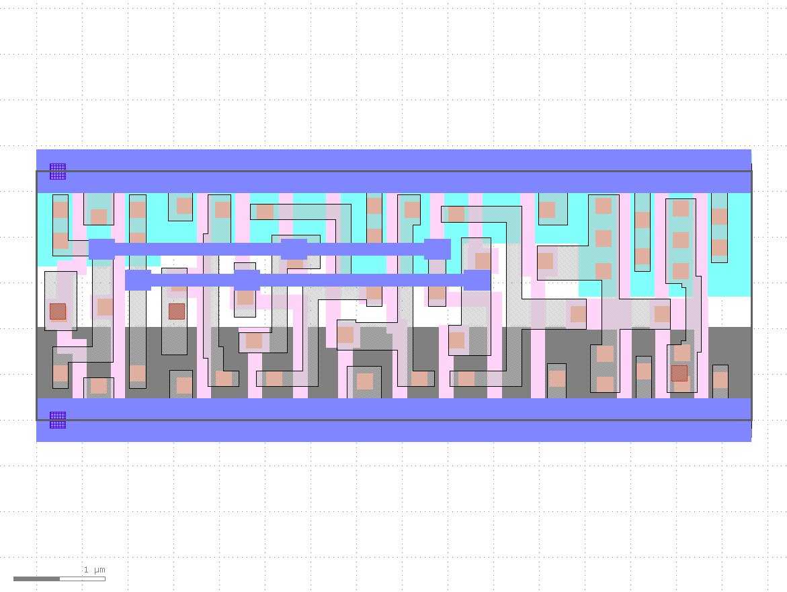

# Interactive flip flop simulation

For a video coming soon to https://www.youtube.com/zerotoasic

## To play with bundled data set from SKY130 df transmission gate flip flop

    cd spice
    tar xf csv.tar.bz2
    ./gui.py

You will probably need to install the [requirements](spice/requirements.txt)

    pip3 install -r spice/requirements.txt

## If you want to build the GDS of the design

After install of openlane/pdk etc, copy this directory to $OPENLANE_ROOT/designs. Then:

    cd $OPENLANE_ROOT
    make mount
    ./flow.tcl -design flipflop_demo

## Create the dataset yourself

This will simulate moving a data pulse through the setup and hold times of a d type flop.

    cd spice
    make setup
    make sim

Takes about 8 mins on my laptop.

## Fun facts

* 26 fets, 13 CMOS pairs
* 7 inverters
* 2 tristate inverters
* 2 transmission gates
